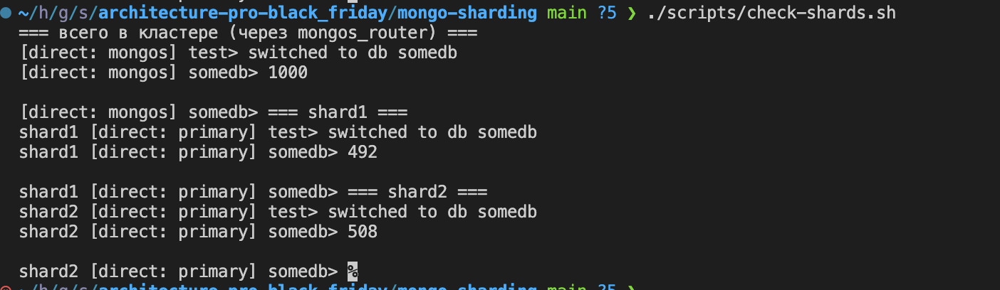
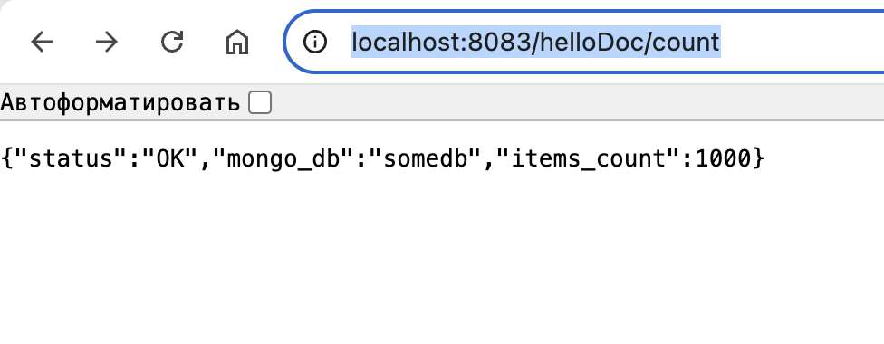
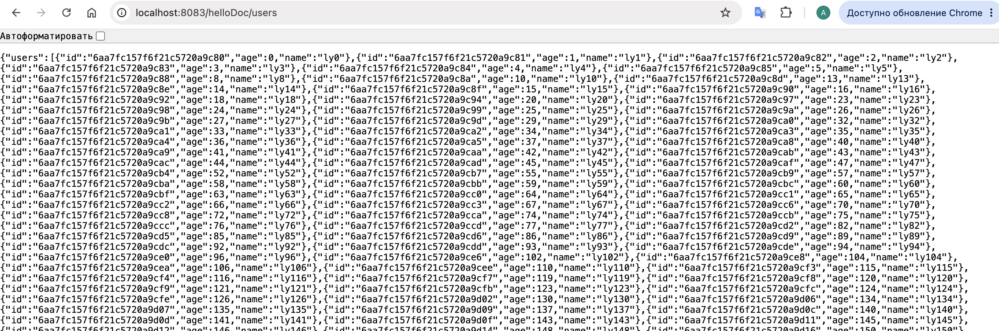

# pymongo-api

## Как запустить

Запускаем mongodb и приложение

```shell
docker compose up -d
```

Заполняем mongodb данными

```shell
./scripts/mongo-init.sh
```

Проверить распределение

```shell
./scripts/check-shards.sh
```


## Как проверить в браузере

### Если вы запускаете проект на локальной машине

Откройте в браузере http://localhost:8083

### Доступные endpoint




### Почистить за собой
```shell
docker compose down -v
```
