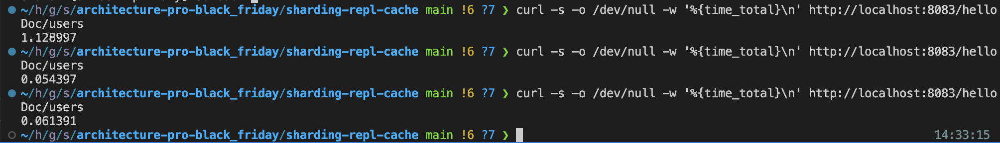

# sharding-repl-cache

## Как запустить

если запускали предыдущее задание то 
```shell
cd ../mongo-sharding-repl
docker compose down -v
cd ../sharding-repl-cache
```

Запускаем mongodb и приложение

```shell
docker compose up -d
```

Заполняем mongodb данными

```shell
./scripts/mongo-init.sh
```

Проверить распределение

```shell
./scripts/check-shards.sh
```

## Как проверить в консоли
```
curl -s -o /dev/null -w '%{time_total}\n' http://localhost:8083/helloDoc/users
curl -s -o /dev/null -w '%{time_total}\n' http://localhost:8083/helloDoc/users
curl -s -o /dev/null -w '%{time_total}\n' http://localhost:8083/helloDoc/users
```


### Почистить за собой
```shell
docker compose down -v
```
